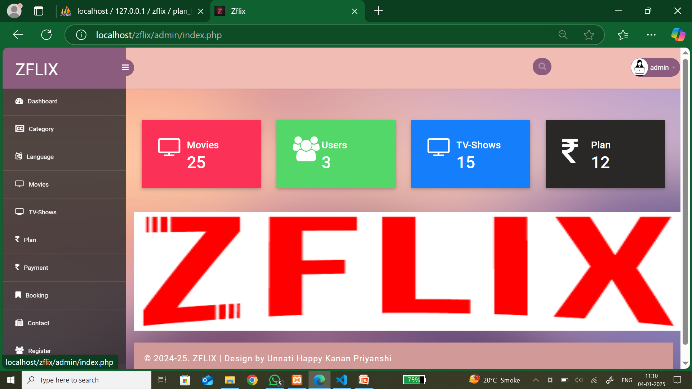
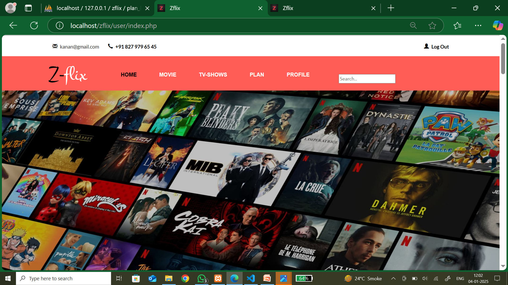
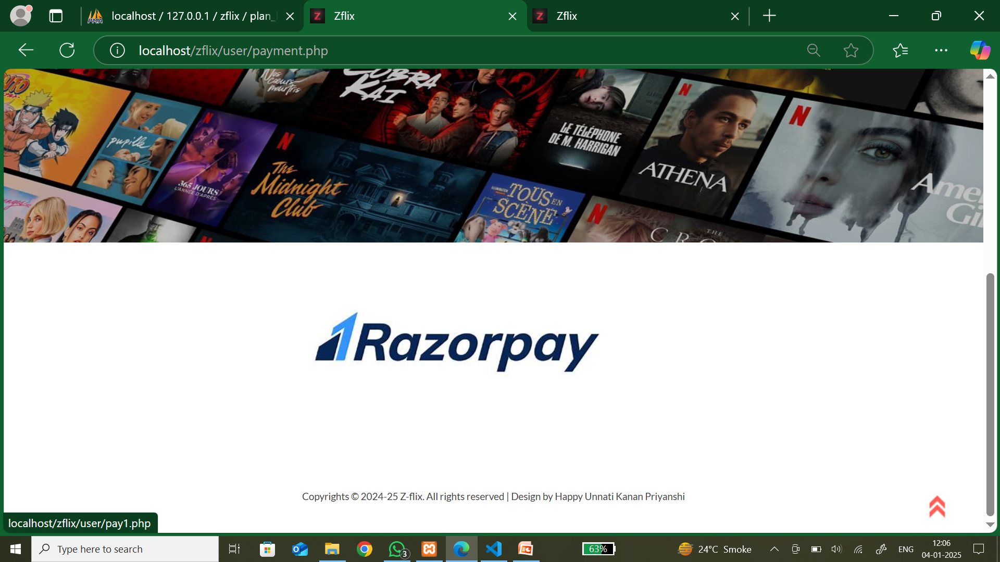
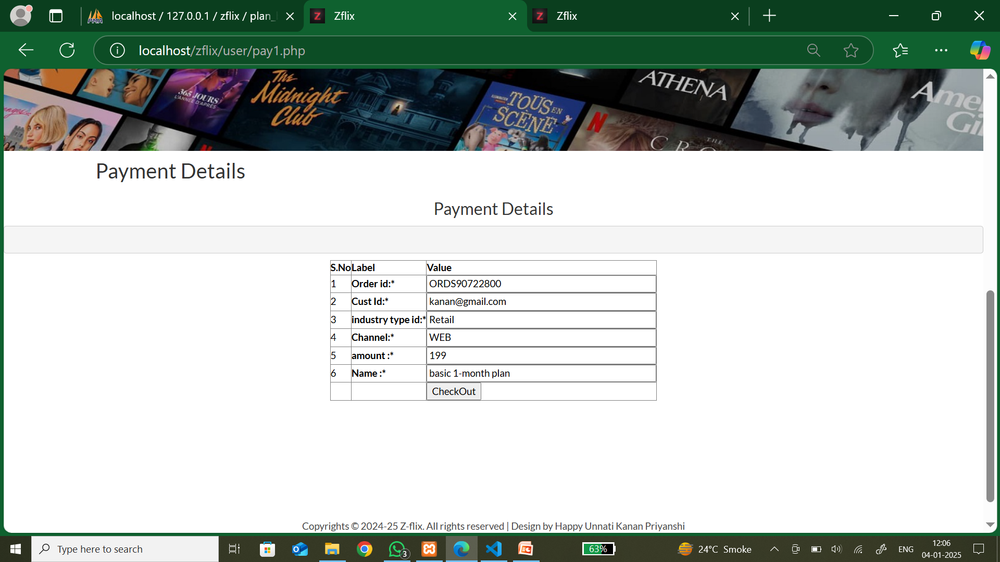
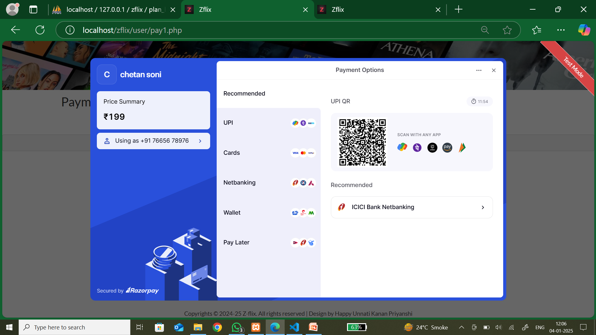
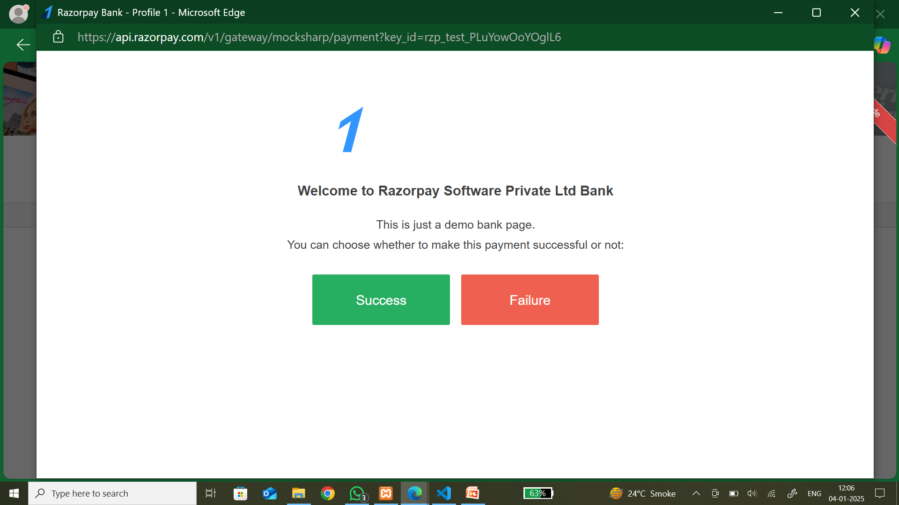
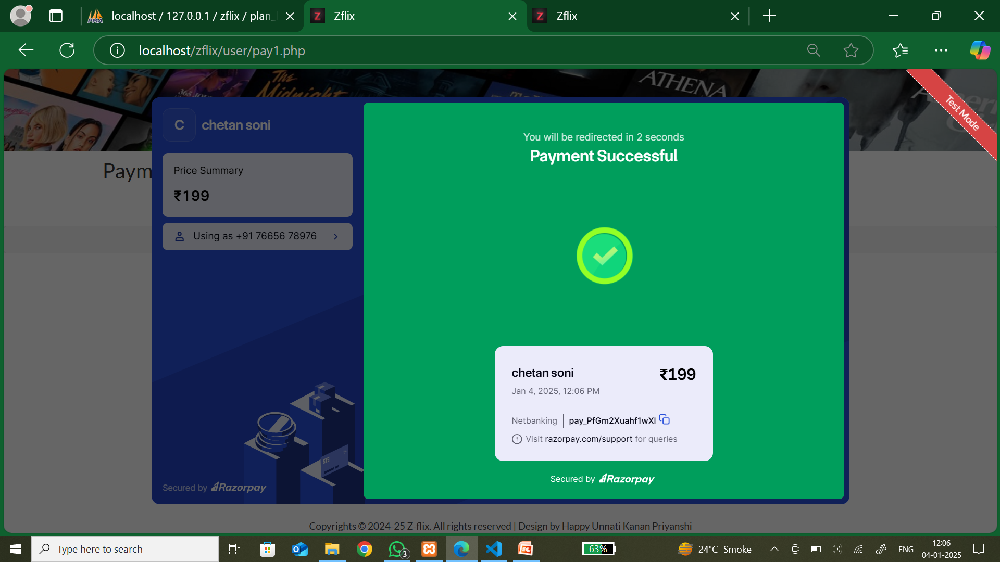
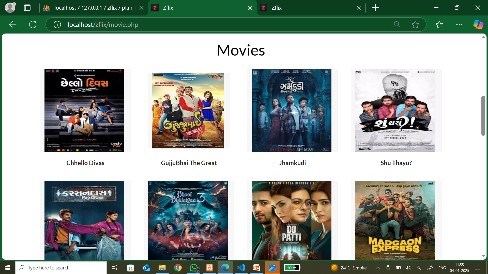

# 🎬 Zflix
A full-stack Movie Streaming Web Application developed using PHP, MySQL, HTML, CSS, JavaScript, and Bootstrap.

## ✨ Features
- 🔐 User Registration & Login
- 🎥 Browse Movies & TV Shows
- 🔎 Search Movies
- 👤 User Profile
- 📱 Responsive Design
- 🗂️ Movie Categories
- ❤️ User-friendly Interface

## 🛠️ Tech Stack
- PHP
- MySQL
- HTML5
- CSS3
- JavaScript
- Bootstrap
- XAMPP

## 📸 Screenshots











## 🚀 Installation

1. Clone the repository
git clone https://github.com/Unnati-bhoi/Zflix.git

2. Move the project into the XAMPP `htdocs` folder.

3. Import the SQL database into phpMyAdmin.

4. Start Apache and MySQL.

5. Open your browser and visit:

http://localhost/Zflix


## 📂 Folder Structure
Zflix/
├── admin/
├── user/
├── assets/
├── css/
├── js/
├── images/
├── database/
└── index.php
```

## 👩‍💻 Author
**Unnati Bhoi**
- 🎓 MCA Student
- 💻 PHP Developer
- 🌐 GitHub: https://github.com/Unnati-bhoi

## ⭐ Future Improvements
- Movie Watchlist
- Dark Mode
- Email Verification
- Password Reset
- Admin Analytics Dashboard

## 📄 License
This project is created for learning and educational purposes.
